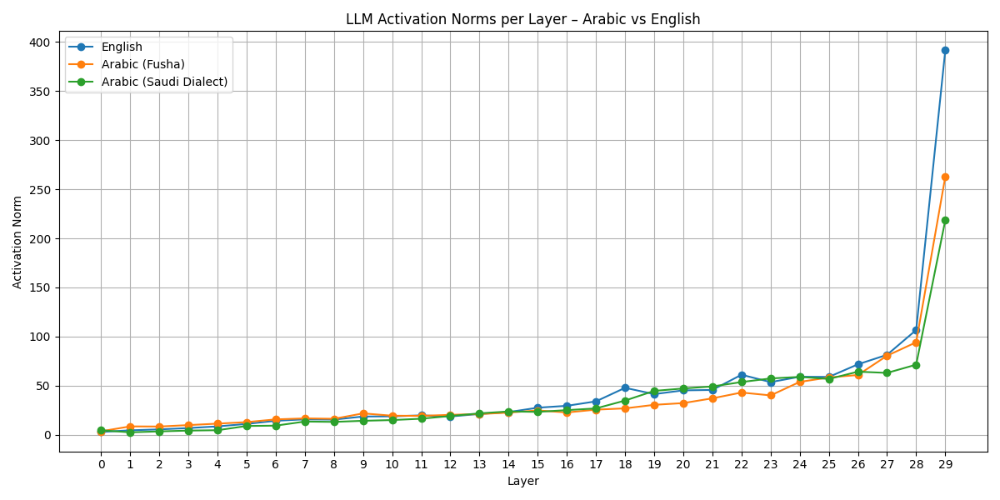
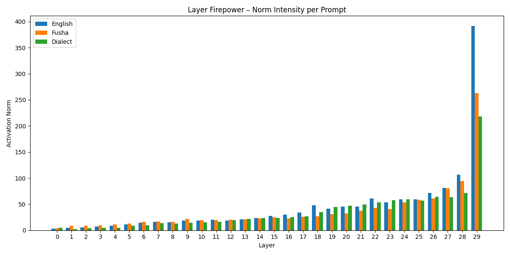
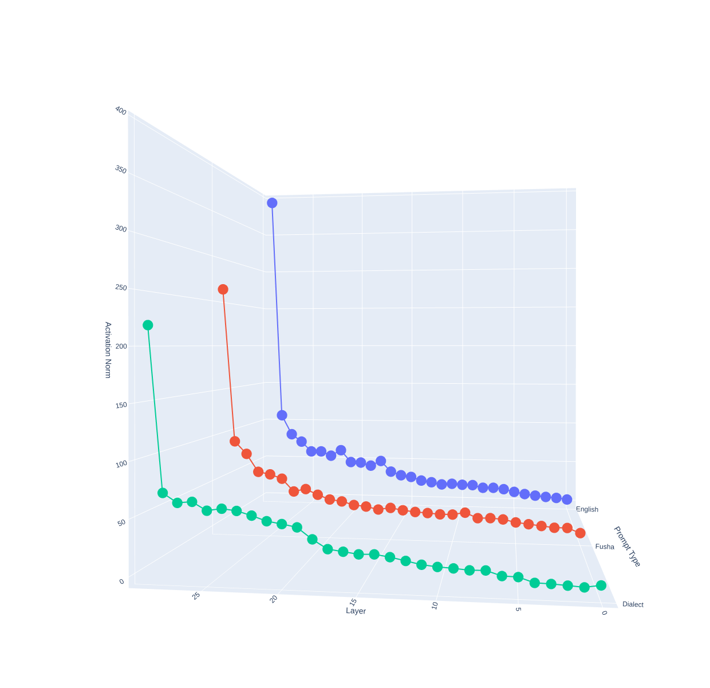
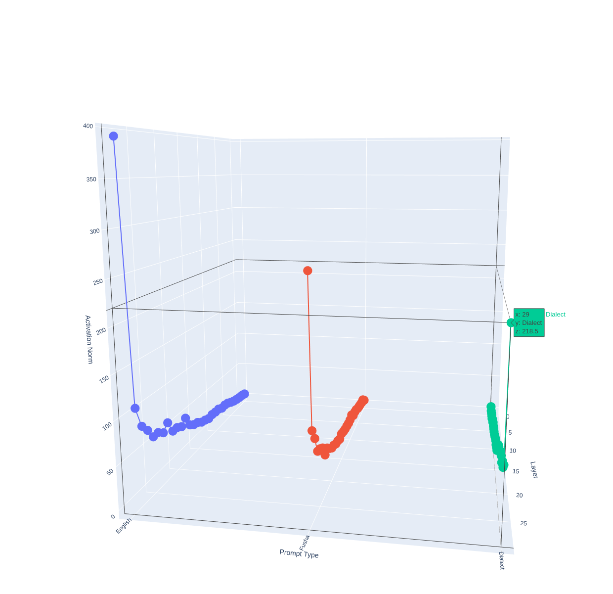
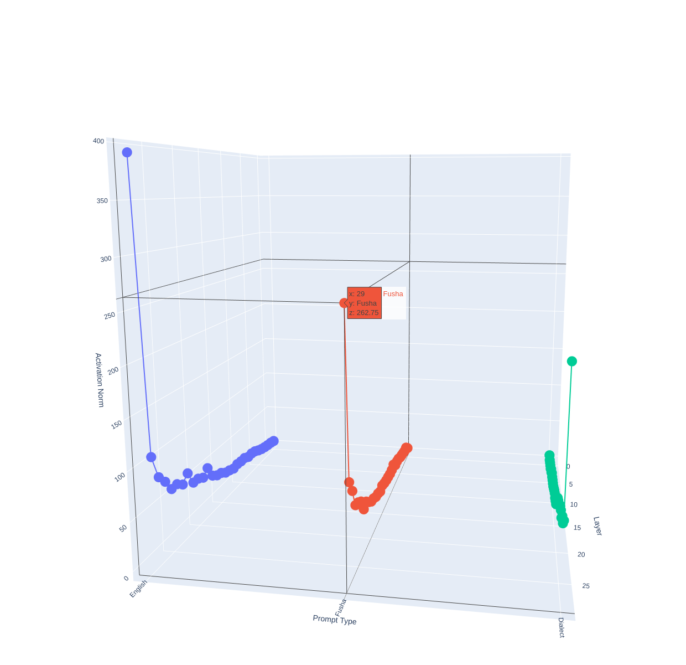
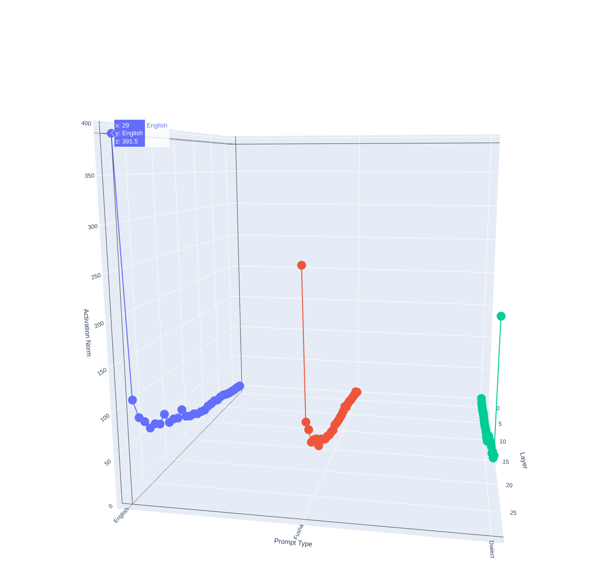
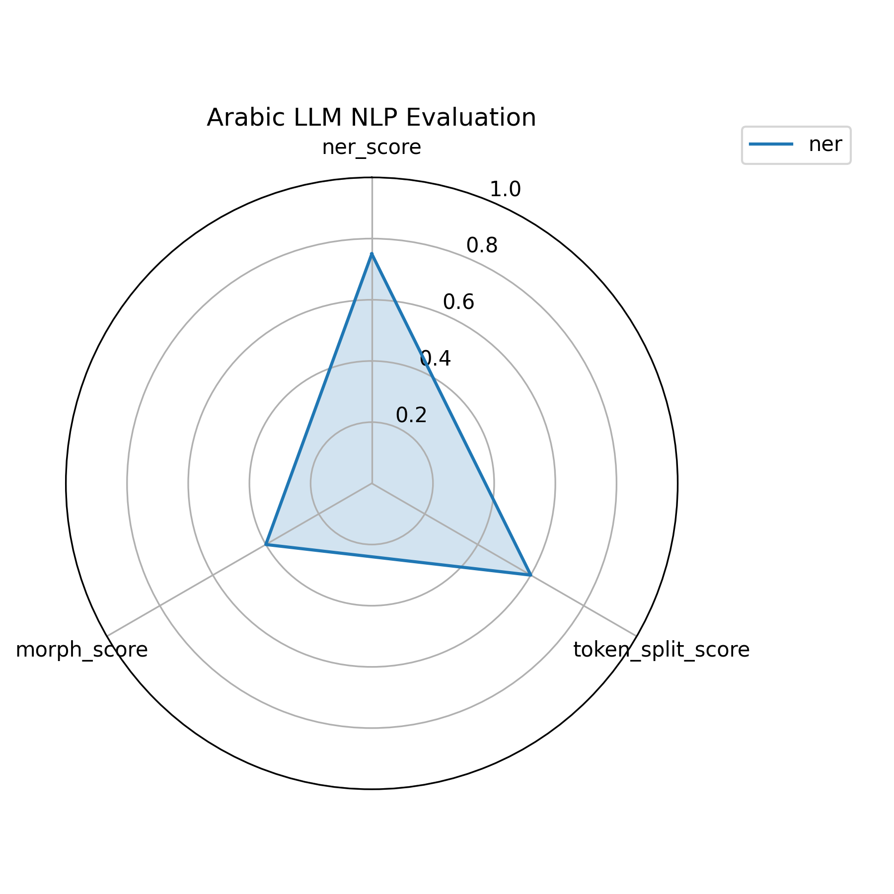
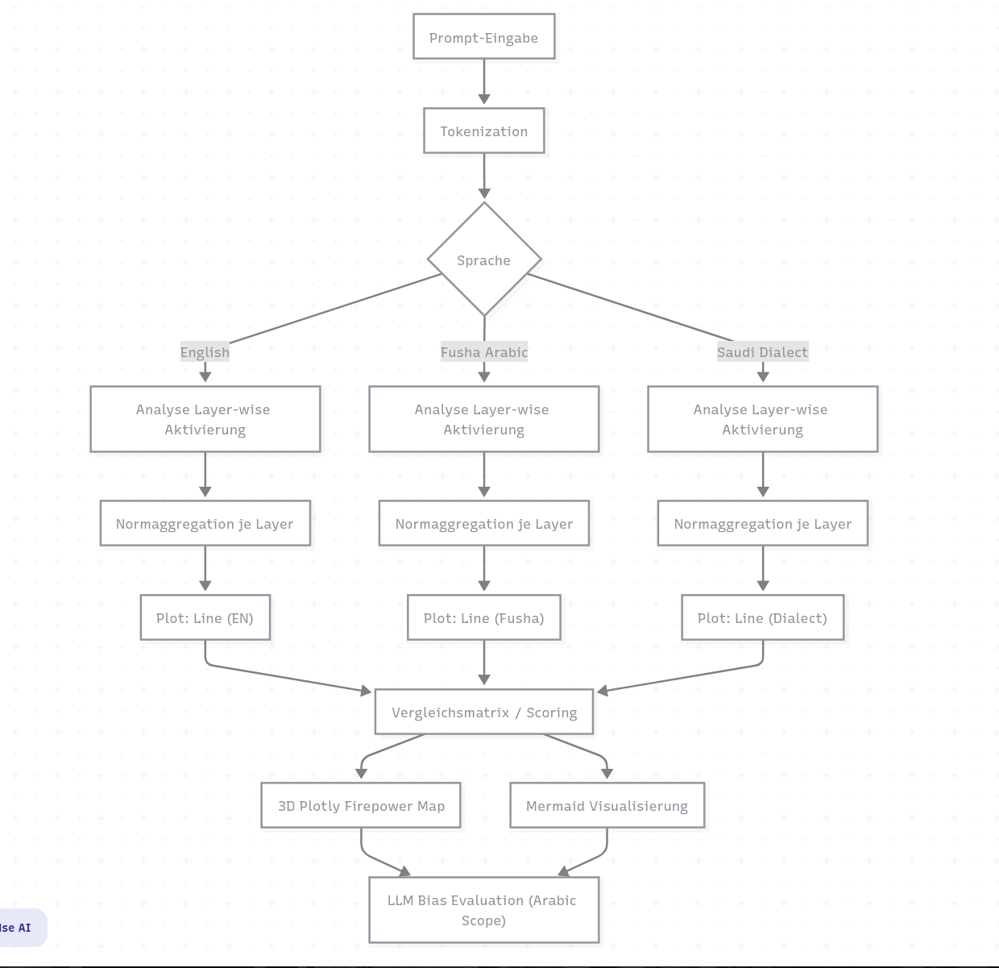

# 🖼️ المشاهدات البصرية لتحليل ArabicLLM-NeuroScope

---

## 🔬 ١. مقارنة النشاط العصبي (Layer-wise Norms)

🧠 **الوصف**: تمثيل بياني لمتوسط تنشيط الـ Norms في كل طبقة Transformer بناءً على لغة الإدخال.  
🔹 **أعلى تنشيط**: الإنجليزية  
🔸 **أقل تنشيط**: اللهجة السعودية  
📉 **الاستنتاج**: الفصحى واللهجة تُعانيان من ضعف التمثيل العصبي.

---

## 🔥 ٢. مقارنة قوة التوكنات (Firepower)

🚀 **الوصف**: مجموع قوة التوكنات عبر كافة الطبقات لكل لغة إدخال.  
📊 **النتيجة**: التوكنات الإنجليزية يتم معالجتها بشكل أعمق وأقوى.  
⚠️ **مؤشر التحيز**: النموذج موجه أساساً نحو الإنجليزية.

---

## 🧠 ٣. خريطة ثلاثية الأبعاد للتنشيط العصبي

🧭 **الوصف**: تمثيل ثلاثي الأبعاد لعلاقة (نوع الإدخال ← رقم الطبقة ← Norm القيمة).  
🧩 **الهدف**: مقارنة العمق العصبي بين الإنجليزية، الفصحى، واللهجة.  
📈 **نمط واضح**: تراجع مستمر في التنشيط مع اللهجات.

---

## 🧪 ٤. مقارنة التمثيل العصبي لكل لغة

| اللغة | الصورة |
|-------|--------|
| 🗣️ اللهجة |  |
| 📖 الفصحى |  |
| 🇬🇧 الإنجليزية |  |

📌 **الملاحظة**: تباين واضح في التنشيط وقوة التوكنات بين اللغات الثلاث.

---

## 🕸️ ٥. تقييم الدلالة (NER, Morphology, Fragility)

🔎 **الوصف**: تغطية التحليل الدلالي على مستوى:
- الكيانات المسماة (NER)
- التحليل الصرفي Morphology
- هشاشة التوكنات (Token Fragility)

📌 **أضعف النتائج**: اللهجة  
📌 **الأعلى دقة**: الإنجليزية  
📌 **المتوسطة**: الفصحى

---

## 🧩 ٦. مخطط Mermaid: منطق التحليل

🧠 **الوصف**: تصور مسار التحليل العصبي والدلالي من الإدخال وحتى المقارنة البصرية والقياس الكمي.  
📎 **المصدر**: `mermaid/mermaid_graph_arabicllm.mmd` و `mermaid/mermaid_nlp.mmd`

---
🧭 ٧. عرض تفاعلي HTML (محلي فقط)
🔗 ملفين تفاعليين بحجم ~4MB كل منهما يمكن فتحهما محليًا:

📂 visual/activation_3d_plot.html
💡 الوصف: تمثيل ثلاثي الأبعاد لمسار التوكنات من اللغة عبر الطبقات وصولًا إلى Norm القيمة.
🧠 الاستخدام: افتح الملف مباشرة على متصفحك لرؤية العمق العصبي بطريقة تفاعلية.

📂 nlp_analysis/nlp_3d_eval.html
🧬 الوصف: عرض تفاعلي للطبقات الدلالية – يُظهر توزع المعلومات من التحليل الدلالي (NER، Fragility) عبر المحاور العصبية.
🔍 الفائدة: مثالي لفهم الفجوة بين العربية والإنجليزية على المستوى التركيبي والتوكني.

⚠️ ملاحظة: يجب تحميل الملفات محليًا وتشغيلها عبر المتصفح (دون رفعها على الإنترنت). الحجم الكلي ~8MB.

---
