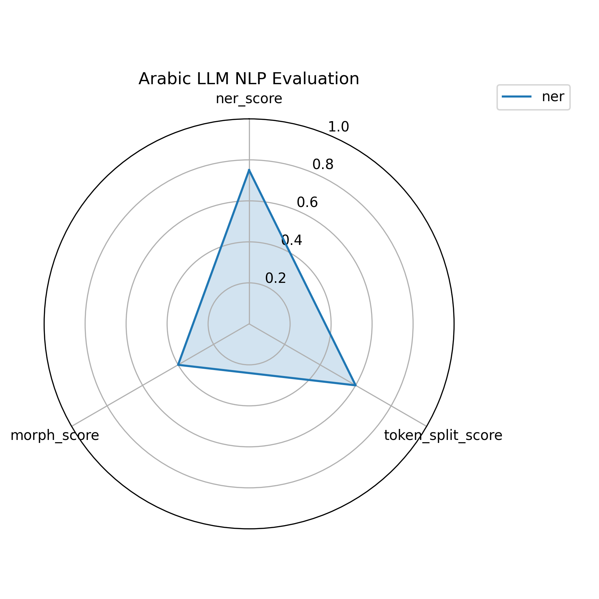

# 🖼️ المشاهدات البصرية لتحليل ArabicLLM-NeuroScope

---

## 🔬 ١. مقارنة النشاط العصبي (Layer-wise Norms)

🧠 **الوصف**: تمثيل بياني لمتوسط تنشيط الـ Norms في كل طبقة Transformer بناءً على لغة الإدخال.  
🔹 **أعلى تنشيط**: الإنجليزية  
🔸 **أقل تنشيط**: اللهجة السعودية  
📉 **الاستنتاج**: الفصحى واللهجة تُعانيان من ضعف التمثيل العصبي.

---

## 🔥 ٢. مقارنة قوة التوكنات (Firepower)

🚀 **الوصف**: مجموع قوة التوكنات عبر كافة الطبقات لكل لغة إدخال.  
📊 **النتيجة**: التوكنات الإنجليزية يتم معالجتها بشكل أعمق وأقوى.  
⚠️ **مؤشر التحيز**: النموذج موجه أساساً نحو الإنجليزية.

---

## 🧠 ٣. خريطة ثلاثية الأبعاد للتنشيط العصبي

🧭 **الوصف**: تمثيل ثلاثي الأبعاد لعلاقة (نوع الإدخال ← رقم الطبقة ← Norm القيمة).  
🧩 **الهدف**: مقارنة العمق العصبي بين الإنجليزية، الفصحى، واللهجة.  
📈 **نمط واضح**: تراجع مستمر في التنشيط مع اللهجات.

---

## 🕸️ ٤. تقييم الدلالة (NER, Morphology, Fragility)

🔎 **الوصف**: تغطية التحليل الدلالي على مستوى:
- الكيانات المسماة (NER)
- التحليل الصرفي Morphology
- هشاشة التوكنات (Token Fragility)

📌 **أضعف النتائج**: اللهجة  
📌 **الأعلى دقة**: الإنجليزية  
📌 **المتوسطة**: الفصحى

---

## 🧩 ٥. مخطط Mermaid: منطق التحليل

🧠 **الوصف**: تصور مسار التحليل العصبي والدلالي من الإدخال وحتى المقارنة البصرية والقياس الكمي.

---

## 🧭 ٦. عرض تفاعلي HTML (متاح محليًا فقط)

📂 [`activation_3d_plot.html`](activation_3d_plot.html)

🌐 **الوصف**: خريطة تفاعلية يمكنك التحرك خلالها لاستكشاف Norms وتغيرها عبر اللغات والطبقات.  
🛠️ **ملاحظة**: يجب فتحها محليًا على المتصفح لعرض محتواها التفاعلي.

---
